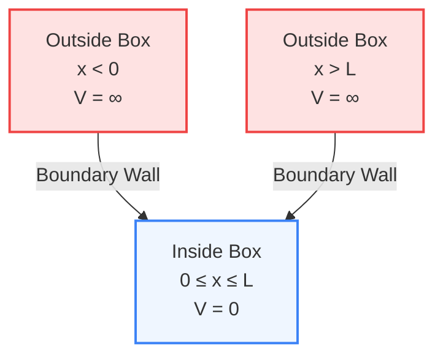

# Module 1 : Atomic & Molecular Structures
## BSCH201 MAKAUT
### Prepared by Rupam Ghosh

---

# Chapter 1: Quantum Mechanics Basics

## 1. Core Concepts: The Schrödinger Wave Equation
The Schrödinger wave equation is the fundamental equation of quantum mechanics. It describes the wave-like behavior of a particle (like an electron) in three-dimensional space.

### The 3D Time-Independent Schrödinger Equation
$$\nabla^2\Psi + \frac{8\pi^2m}{h^2}(E - V)\Psi = 0$$

#### Variable Glossary
| Symbol | Term | Description |
| :---: | :--- | :--- |
| **$\Psi$** | Psi | The wave function, representing the amplitude of the electron wave. |
| **$\nabla^2$** | Del squared | The Laplacian operator: $\left(\frac{\partial^2}{\partial x^2} + \frac{\partial^2}{\partial y^2} + \frac{\partial^2}{\partial z^2}\right)$ |
| **$m$** | Mass | Mass of the particle. |
| **$h$** | Planck's constant | Universal physical constant. |
| **$E$** | Total energy | Total energy of the particle. |
| **$V$** | Potential energy | Potential energy of the particle. |

### Conditions for an Acceptable Wave Function ($\Psi$)
For a wave function to physically make sense, it must satisfy the following four core criteria:

| # | Condition | Explanation |
| :-: | :--- | :--- |
| **1** | **Single-valued** | It can only have one value at any given point in space. |
| **2** | **Continuous** | There can be no sudden breaks in the wave. |
| **3** | **Finite** | It cannot go to infinity. |
| **4** | **Normalized** | The total probability of finding the particle somewhere in space must equal 1. |

## 2. Application: Particle in a 1D Box
This model imagines a particle (like an electron) trapped in a perfectly rigid, one-dimensional box of length $L$. Inside the box, the potential energy ($V$) is zero. Outside the box, the potential energy is infinite, meaning the particle cannot escape.

### Key Properties

*   **Energy Levels:** Solving the Schrödinger equation for this system gives quantized energy levels:
    $$E_n = \frac{n^2h^2}{8mL^2}$$
    *(where $n = 1, 2, 3...$ representing the principal quantum number)*.
*   **Zero-Point Energy:** The lowest possible energy state is when $n = 1$. The energy is never zero:
    $$E_1 = \frac{h^2}{8mL^2}$$
    If the energy were zero, the particle would be completely at rest, meaning we would know its exact position and momentum simultaneously, which violates **Heisenberg's Uncertainty Principle**.
*   **Application to Polyenes:** This simple 1D box model is incredibly useful for approximating the energy spectra of conjugated polyenes (molecules with alternating single and double bonds, like butadiene). The delocalized $\pi$-electrons are treated as "particles" moving freely along the 1D "box" created by the carbon chain.

### Previous Year Questions & Solutions (PYQs)

Here are the questions that have appeared in your university exams regarding these topics, along with their solutions:

#### Q1. Which of the following is the expression of Schrodinger wave equation? *(2018-19, 1 Mark)*

(a) $\nabla^2\Psi + (h^2/8\pi^2m)(E - V)\Psi = 0$

(b) $\nabla^2\Psi + (8\pi^2m/h^2)(E - V)\Psi = 0$

(c) $(-\hbar^2/2m\nabla^2 + E)\Psi - V\Psi = 0$

(d) $(-2m/\hbar^2\nabla^2 + V)\Psi - E\Psi = 0$

**Solution:** **(b)** is the correct standard mathematical expression for the time-independent Schrödinger wave equation.

#### Q2. Write down the time independent 1D Schrodinger's wave equation and mention the terms involved. *(2024 SEM1, 1 Mark)*

**Solution:**
For a 1D system (along the x-axis), the equation simplifies to:
$$\frac{d^2\Psi}{dx^2} + \frac{8\pi^2m}{h^2}(E - V)\Psi = 0$$

*Terms:* $\Psi$ is the wave function, $x$ is the position coordinate, $m$ is the mass of the particle, $h$ is Planck's constant, $E$ is the total energy, and $V$ is the potential energy.

#### Q3. Prove that $(V - \frac{h^2}{8\pi^2m}\nabla^2)\Psi = E\Psi$. *(2018-19 & 2023 SEM2, 5 Marks)*

**Solution:**
1. Start with the standard time-independent Schrödinger equation: 
   $$\nabla^2\Psi + \frac{8\pi^2m}{h^2}(E - V)\Psi = 0$$
2. Multiply the entire equation by $-\frac{h^2}{8\pi^2m}$:
   $$-\frac{h^2}{8\pi^2m}\nabla^2\Psi - (E - V)\Psi = 0$$
3. Expand the terms:
   $$-\frac{h^2}{8\pi^2m}\nabla^2\Psi - E\Psi + V\Psi = 0$$
4. Rearrange to group the operators acting on $\Psi$ on one side:
   $$V\Psi - \frac{h^2}{8\pi^2m}\nabla^2\Psi = E\Psi$$
5. Factor out $\Psi$:
   $$\left(V - \frac{h^2}{8\pi^2m}\nabla^2\right)\Psi = E\Psi$$ *(Hence Proved)*

*(Note: The term in the parentheses is the Hamiltonian operator, denoted as $\hat{H}$, so this is just proving $\hat{H}\Psi = E\Psi$)*.

#### Q4. Write the conditions of acceptable wave function $\Psi$. *(2024 SEM1, 5 Marks)*

**Solution:** 
For a wave function to be physically acceptable, it must meet these criteria:
1. **Single-valued:** $\Psi$ must have only one value at any particular point $(x, y, z)$ so that the probability of finding the electron at that point is unambiguous.
2. **Continuous:** $\Psi$ and its first derivatives ($\frac{\partial\Psi}{\partial x}$, etc.) must be continuous across all space.
3. **Finite:** $\Psi$ must not become infinite at any point, otherwise, the probability of finding the particle there would be infinite.
4. **Square-integrable (Normalized):** The integral of $|\Psi|^2$ over all space must be exactly 1, meaning the particle must definitely exist somewhere in the universe.

#### Q5. (c) What is zero point energy of a particle in one dimensional box? Why the energy of this particle cannot be zero at zero point energy? If the zero point energy of the particle in one dimensional box is 2.5 eV, what is the next higher energy value? *(2023 SEM2, 5 Marks)*

**Solution:**
*   **Zero Point Energy:** It is the lowest possible energy a particle can possess in a 1D box, occurring when the quantum number $n = 1$. The formula is $E_1 = \frac{h^2}{8mL^2}$.
*   **Why it cannot be zero:** If $E = 0$, then the momentum ($p$) is exactly zero. If momentum is zero, the particle is completely at rest, meaning uncertainty in momentum ($\Delta p$) is zero. According to Heisenberg's Uncertainty Principle ($\Delta x \cdot \Delta p \ge \frac{h}{4\pi}$), if $\Delta p = 0$, the uncertainty in position ($\Delta x$) must be infinite. However, the particle is confined to a box of length $L$, so $\Delta x$ cannot be infinite. Therefore, the energy cannot be zero.
*   **Calculation:** 
    We know the energy level formula is $E_n = n^2 \cdot E_1$.
    Given Zero Point Energy ($E_1$) = 2.5 eV.
    The next higher energy state is for $n = 2$.
    $$E_2 = (2)^2 \cdot E_1 = 4 \cdot 2.5 \text{ eV} = \mathbf{10.0 \text{ eV}}$$
---
# Chapter 2: Molecular Orbital (MO) Theory

## 1. Core Concepts: Molecular Orbital Theory
Molecular Orbital (MO) Theory provides a more accurate view of molecular bonding than Valence Bond Theory (VBT). It assumes that atomic orbitals combine to form molecular orbitals that span the entire molecule.

### Linear Combination of Atomic Orbitals (LCAO)
When two atomic wave functions ($\Psi_A$ and $\Psi_B$) combine, they form two molecular orbitals:

| Property | Bonding Molecular Orbital (MO) | Antibonding Molecular Orbital (MO*) |
| :--- | :--- | :--- |
| **Formation** | Addition of wave functions ($\Psi_A + \Psi_B$) | Subtraction of wave functions ($\Psi_A - \Psi_B$) |
| **Energy Level** | Lower energy | Higher energy (denoted with an asterisk *) |
| **Stability** | Higher stability | Lower stability |

### Bond Order (BO)
This value indicates the strength and type of bond (single, double, triple).

$$\text{Bond Order} = \frac{1}{2} (N_b - N_a)$$
*(where $N_b$ is the number of bonding electrons and $N_a$ is the number of antibonding electrons)*

> [!TIP]
> **Key Relationship:** Higher Bond Order = Higher Bond Dissociation Energy = Shorter Bond Length. If BO = 0, the molecule does not exist.

### Magnetic Properties
| Property | Paramagnetic | Diamagnetic |
| :--- | :--- | :--- |
| **Electron State** | One or more **unpaired** electrons | All electrons are **paired** |
| **Behavior** | Attracted to a magnetic field | Weakly repelled by a magnetic field |

### Previous Year Questions & Solutions (PYQs)

MO Theory is one of the most heavily tested areas in Module 1, specifically asking you to calculate bond order, explain magnetic properties, and draw energy level diagrams.

#### Q1. Which one of the following correctly represents the formation of bonding molecular orbital from atomic orbitals having wave functions $\Psi_A$ and $\Psi_B$? *(2019-20, 1 Mark)*

(a) $\Psi_A \times \Psi_B$ 

(b) $\Psi_A / \Psi_B$ 

(c) $\Psi_A + \Psi_B$ 

(d) $\Psi_A - \Psi_B$

**Solution:** **(c) $\Psi_A + \Psi_B$**. Bonding MOs are formed by the constructive interference (addition) of atomic orbitals. (Option 'd' represents an antibonding MO).

#### Q2. Why does the $\text{He}_2$ molecule not exist? *(2024 SEM1, 1 Mark)*

**Solution:** A Helium atom has 2 electrons ($1s^2$), so $\text{He}_2$ would have 4 electrons. Filling the MOs gives: $\sigma_{1s}^2, \sigma_{1s}^{*2}$. 

Bond Order = $\frac{1}{2} (N_b - N_a) = \frac{1}{2} (2 - 2) = 0$. 

Because the bond order is zero, no bond is formed, and the molecule does not exist.

#### Q3. The correct order of bond dissociation energy is: *(2018-19, 1 Mark)*

(a) $\text{O}_2 \lt \text{O}_2^+ \lt \text{O}_2^- \lt \text{O}_2^{2-}$ 

(b) $\text{O}_2^{2-} \lt \text{O}_2^- \lt \text{O}_2 \lt \text{O}_2^+$

(c) $\text{O}_2^{2-} \lt \text{O}_2 \lt \text{O}_2^- \lt \text{O}_2^+$ 

(d) $\text{O}_2 \lt \text{O}_2^{2-} \lt \text{O}_2^+ \lt \text{O}_2^-$

**Solution: (b)**. Bond dissociation energy is directly proportional to Bond Order. Let's calculate the BO for each species based on their valence electrons:
*   $\text{O}_2$ (12 valence e-): BO = 2.0
*   $\text{O}_2^+$ (11 valence e-): BO = 2.5
*   $\text{O}_2^-$ (13 valence e-): BO = 1.5
*   $\text{O}_2^{2-}$ (14 valence e-): BO = 1.0

Increasing order of BO (and thus dissociation energy): **$\text{O}_2^{2-} \lt \text{O}_2^- \lt \text{O}_2 \lt \text{O}_2^+$**.

#### Q4. (a) Draw the molecular energy level diagram for $\text{O}_2$. (b) Explain the paramagnetic behaviour of $\text{O}_2$ under the light of MO theory as an evidence of failure of VBT. *(2018-19, 5 Marks)*

**Solution:**

**(a) MO Diagram Configuration for $\text{O}_2$ (16 total electrons):** 
$$\sigma_{1s}^2 \lt \sigma_{1s}^{*2} \lt \sigma_{2s}^2 \lt \sigma_{2s}^{*2} \lt \sigma_{2p_z}^2 \lt (\pi_{2p_x}^2 = \pi_{2p_y}^2) \lt (\pi_{2p_x}^{*1} = \pi_{2p_y}^{*1})$$

*(For the exam, you will need to draw the standard vertical energy level diagram showing the atomic orbitals of O on the left and right, and the molecular orbitals in the middle).*

**(b) Failure of VBT:** Valence Bond Theory (Lewis dot structure) depicts $\text{O}_2$ with a double bond and all electrons paired, incorrectly predicting it to be diamagnetic. However, liquid oxygen is attracted to a magnet. MO Theory successfully explains this: as seen in the configuration above, the highest occupied molecular orbitals are two degenerate antibonding $\pi^*$ orbitals, each containing one **unpaired electron** ($\pi_{2p_x}^{*1}$ and $\pi_{2p_y}^{*1}$), making the molecule paramagnetic.

#### Q5. $\text{NO}$ is paramagnetic while $\text{NO}^+$ is diamagnetic. Justify using MO diagram. Write electronic configuration of $\text{NO}$. *(2024 SEM1 & 2025 SEM1, 5 Marks)*

**Solution:**
*   **$\text{NO}$ (15 total electrons):** The electronic configuration is:
    $$\sigma_{1s}^2 \lt \sigma_{1s}^{*2} \lt \sigma_{2s}^2 \lt \sigma_{2s}^{*2} \lt \sigma_{2p_z}^2 \lt (\pi_{2p_x}^2 = \pi_{2p_y}^2) \lt \pi_{2p_x}^{*1}$$
    Because it has **one unpaired electron** in the $\pi_{2p_x}^*$ orbital, $\text{NO}$ is **paramagnetic**.
*   **$\text{NO}^+$ (14 total electrons):** Removing one electron from NO takes away the unpaired electron in the antibonding orbital. The configuration ends at $(\pi_{2p_x}^2 = \pi_{2p_y}^2)$. Since **all electrons are now paired**, $\text{NO}^+$ is **diamagnetic**.

#### Q6. Give molecular orbital energy level diagram of $\text{CO}$. Write its electronic configuration, magnetic behaviour and bond order. *(2019-20 & 2023 SEM2, 5 Marks)*

**Solution:** 
Carbon Monoxide is a heteronuclear diatomic molecule with 14 total electrons (6 from C, 8 from O). Because oxygen is more electronegative, its atomic orbitals are drawn lower in energy than carbon's.
*   **Electronic Configuration:**
    $$\sigma_{1s}^2 \lt \sigma_{1s}^{*2} \lt \sigma_{2s}^2 \lt \sigma_{2s}^{*2} \lt (\pi_{2p_x}^2 = \pi_{2p_y}^2) \lt \sigma_{2p_z}^2$$
*   **Bond Order:** $N_b = 10, N_a = 4 \rightarrow \text{BO} = \frac{10 - 4}{2} = \mathbf{3}$.
*   **Magnetic Behaviour:** All electrons are paired in the molecular orbitals, so CO is **diamagnetic**.

#### Q7. Determine the bond order of each member of the following groups, and determine which member of each group is predicted by the molecular orbital model to have the strongest bond: (i) $\text{H}_2, \text{H}_2^+, \text{H}_2^-$ (ii) $\text{O}_2, \text{O}_2^{2+}, \text{O}_2^{2-}$ *(2019-20, 4 Marks)*

**Solution:** 

##### Group (i) Analysis
| Species | Electrons | Calculation | Bond Order | Result |
| :---: | :---: | :---: | :---: | :--- |
| $\text{H}_2$ | 2 | $(2 - 0)/2$ | **1.0** | **Strongest Bond** (highest BO) |
| $\text{H}_2^+$ | 1 | $(1 - 0)/2$ | **0.5** | |
| $\text{H}_2^-$ | 3 | $(2 - 1)/2$ | **0.5** | |

##### Group (ii) Analysis
| Species | Valence Electrons | Bond Order | Result / Notes |
| :---: | :---: | :---: | :--- |
| $\text{O}_2$ | 12 | **2.0** | |
| $\text{O}_2^{2+}$ | 10 | **3.0** | **Strongest Bond** *(isoelectronic with $\text{N}_2$)* |
| $\text{O}_2^{2-}$ | 14 | **1.0** | *(isoelectronic with $\text{F}_2$)* |
---
# Chapter 3: $\pi$-Molecular Orbitals & Aromaticity

## 1. Core Concepts: $\pi$-Molecular Orbitals
When molecules have alternating single and double bonds (like butadiene or benzene), they have a "conjugated" system.
*   In these systems, the unhybridized $p$-orbitals on adjacent carbon atoms overlap side-by-side to form a continuous cloud of $\pi$ electrons above and below the plane of the molecule.
*   Instead of belonging to just one bond, these $\pi$ electrons are **delocalized** over the entire structure, which significantly lowers the energy of the molecule and increases its stability.
*   For example, **Benzene** has six $p$-orbitals that combine to form six $\pi$-molecular orbitals: three lower-energy bonding orbitals and three higher-energy antibonding orbitals.

## 2. Core Concepts: Rules of Aromaticity (Hückel's Rule)
Aromatic compounds are incredibly stable due to their delocalized $\pi$ electron rings. To determine the category of a ring compound, we evaluate it against Hückel's criteria:

### Aromaticity Classification Matrix
| Classification | Cyclic | Planar | Conjugation | $\pi$ Electron Count | Relative Stability |
| :--- | :---: | :---: | :---: | :---: | :--- |
| **Aromatic** | Yes | Yes | Complete | **$4n + 2$** (2, 6, 10, 14...) | **Exceptionally High** |
| **Anti-aromatic** | Yes | Yes | Complete | **$4n$** (4, 8, 12...) | **Highly Unstable** (reactive) |
| **Non-aromatic** | Fails one or more of the cyclic, planar, or conjugation rules | Any | **Standard** (unaffected by ring) |

*   **Anti-aromatic:** A molecule is anti-aromatic if it is cyclic, planar, and conjugated (meets rules 1-3) but has **$4n$ $\pi$ electrons** (e.g., 4, 8, 12). These compounds are highly unstable.
*   **Non-aromatic:** A molecule is non-aromatic if it fails any of the first three criteria (e.g., it is not a closed ring, it is not flat, or it has an $sp^3$ carbon disrupting the conjugation).

### Previous Year Questions & Solutions (PYQs)

This section is very scoring. Exams repeatedly ask you to state the rules of aromaticity and classify specific molecules.

#### Q1. Write the criteria for a compound to be aromatic. / Write down the criteria for aromaticity. *(2023 SEM1, 1 Mark & 2019-20, 1 Mark)*

**Solution:** For a compound to be considered aromatic, it must satisfy the following four criteria:
1. It must be a cyclic molecule.
2. The molecule must be planar (flat).
3. It must be completely conjugated (having a continuous ring of overlapping $p$-orbitals).
4. It must obey Hückel's rule, meaning it possesses $(4n + 2)$ delocalized $\pi$ electrons, where $n = 0, 1, 2, 3...$

#### Q2. What are anti-aromatic compounds? Give examples. *(2023 SEM1, 3 Marks)*

**Solution:** 
Anti-aromatic compounds are cyclic, planar, and completely conjugated molecules, but they contain **$4n$ $\pi$ electrons** (where $n = 1, 2, 3...$, giving 4, 8, 12 $\pi$ electrons). Because of this electron count, the delocalization actually destabilizes the molecule, making anti-aromatic compounds highly reactive and unstable.

*Example:* **Cyclobutadiene**. It is a 4-membered planar ring with alternating double and single bonds, but it has exactly $4 \pi$ electrons, making it anti-aromatic.

#### Q3. Draw the $\pi$-molecular orbital diagram of Benzene. Predict whether the following compounds are aromatic, anti-aromatic or non-aromatic: (i) Furan (ii) Cyclopentadienyl cation. *(2023 SEM2, 5 Marks)*

**Solution:**

##### Part A: $\pi$-MO Diagram of Benzene
*(Note: You will need to draw the Frost Circle/Energy level diagram for the exam).* 

Benzene has 6 carbon atoms contributing 6 $p$-orbitals, forming 6 $\pi$-MOs. 
*   The lowest energy orbital is $\psi_1$ (bonding).
*   Above it are two degenerate (equal energy) bonding orbitals, $\psi_2$ and $\psi_3$.
*   Above the energy centerline are two degenerate antibonding orbitals, $\psi_4^*$ and $\psi_5^*$.
*   The highest energy orbital is $\psi_6^*$ (antibonding).

Benzene has 6 $\pi$ electrons. Following Hund's rule and the Pauli exclusion principle, they completely fill the three bonding orbitals ($\psi_1^2, \psi_2^2, \psi_3^2$), leaving all antibonding orbitals empty. This completely filled bonding shell explains benzene's extraordinary aromatic stability.

##### Part B: Predicting Aromaticity

| Compound | Cyclic / Planar | Conjugation | $\pi$ Electrons | Classification | Detailed Reasoning |
| :--- | :---: | :---: | :---: | :---: | :--- |
| **(i) Furan** | Yes / Yes | Complete | **6** | **Aromatic** | Possesses 4 $\pi$ electrons from double bonds + 2 from one of oxygen's lone pairs (which occupies a parallel $p$-orbital). Fits $4n+2$ ($n=1$). |
| **(ii) Cyclopentadienyl cation** | Yes / Yes | Complete | **4** | **Anti-aromatic** | Possesses 4 $\pi$ electrons from two double bonds. The 5th carbon is $sp^2$ with an empty $p$-orbital, allowing conjugation but bringing total $\pi$ count to 4. Fits $4n$ ($n=1$). |

---
# Chapter 4: Crystal Field Theory (CFT)

## 1. Core Concepts: Crystal Field Theory
Crystal Field Theory explains the bonding, colors, and magnetic properties of transition metal complexes. It assumes that the interaction between the central metal ion and the surrounding ligands is purely electrostatic.

### d-Orbital Splitting Behavior
In a free metal ion, all five d-orbitals have the same energy (they are degenerate). When ligands approach the metal to form a complex, their negative electron clouds repel the electrons in the metal's d-orbitals, causing the orbitals to split into different energy levels.

| Field Geometry | Ligand Approach | Stronger Repulsion (Higher Set) | Weaker Repulsion (Lower Set) | Splitting Parameter | Spin States |
| :--- | :--- | :---: | :---: | :---: | :--- |
| **Octahedral** | Along the axes ($x, y, z$) | $e_g$ ($d_{x^2-y^2}$, $d_{z^2}$) | $t_{2g}$ ($d_{xy}$, $d_{yz}$, $d_{zx}$) | $\Delta_o$ | High-spin or Low-spin |
| **Tetrahedral** | Between the axes | $t_2$ ($d_{xy}$, $d_{yz}$, $d_{zx}$) | $e$ ($d_{x^2-y^2}$, $d_{z^2}$) | $\Delta_t \approx \frac{4}{9}\Delta_o$ | Almost exclusively High-spin |

### High-Spin vs. Low-Spin Complexes
| Property | High-Spin Complexes | Low-Spin Complexes |
| :--- | :--- | :--- |
| **Ligand Strength** | Weak Field Ligands (e.g., $F^-$, $Cl^-$, $H_2O$) | Strong Field Ligands (e.g., $CN^-$, $CO$) |
| **Splitting Gap vs. Pairing Energy** | Small splitting gap ($\Delta_o \lt P$) | Large splitting gap ($\Delta_o \gt P$) |
| **Electron Placement** | Electrons fill upper set before pairing in lower set | Electrons pair up in lower set before moving to upper set |
| **Unpaired Electrons** | Maximized | Minimized |

*   **Crystal Field Stabilization Energy (CFSE):** The energy gained by placing electrons in lower-energy orbitals compared to the unsplit state. For octahedral complexes, electrons in $t_{2g}$ lower the energy by $-0.4\Delta_o$, and electrons in $e_g$ raise it by $+0.6\Delta_o$.
*   **Magnetic Moment ($\mu$):** Calculated using the "spin-only" formula:
    $$\mu = \sqrt{n(n+2)}\text{ Bohr Magnetons (BM)}$$
    *(where $n$ is the number of unpaired electrons)*

### Previous Year Questions & Solutions (PYQs)

This topic is highly mathematical and conceptual, frequently appearing in 3-mark and 5-mark questions.

#### Q1. For transition metal octahedral complexes, the choice between high spin and low spin electronic configurations arises only for: *(2019-20, 1 Mark)*

(a) $d^1$ to $d^3$ complexes

(b) $d^4$ to $d^7$ complexes

(c) $d^8$ to $d^9$ complexes

(d) $d^1, d^2$ and $d^8$ complexes

**Solution: (b) $d^4$ to $d^7$ complexes.** 
For $d^1, d^2,$ and $d^3$, the electrons just fill the bottom three $t_{2g}$ orbitals singly. For $d^8, d^9,$ and $d^{10}$, the bottom is completely filled and the top is partially/fully filled the same way regardless of ligand strength. The choice of pairing up vs. jumping the gap only happens when placing the 4th, 5th, 6th, and 7th electrons.

#### Q2. (a) Show the splitting of d-orbitals in a tetrahedral field. (b) Low spin complexes are not obtained in tetrahedral crystal field — Give reason. *(2023 SEM1, 3+3 Marks)*

**Solution:**

**(a) Splitting in Tetrahedral Field:** 
*(Draw a diagram showing 5 degenerate d-orbitals on the left, splitting into 2 lower energy orbitals labelled '$e$' and 3 higher energy orbitals labelled '$t_2$' on the right. The gap is $\Delta_t$.)*

**(b) Reason:** The crystal field splitting energy for a tetrahedral field ($\Delta_t$) is much smaller than for an octahedral field ($\Delta_t \approx \frac{4}{9} \Delta_o$). Because this energy gap is so small, it is almost always less than the pairing energy ($P$). Therefore, electrons will easily jump to the higher $t_2$ orbitals rather than pair up in the lower $e$ orbitals, leading exclusively to high-spin complexes.

#### Q3. Show the hybridization and calculate the CFSE of $[Fe^{2+}(H_2O)_6]^{2+}$ and $[Fe^{3+}(H_2O)_6]^{3+}$ complex ions. *(2018-19, 4 Marks)*

**Solution:**
Iron (Fe) has an atomic number of 26 ($3d^6 4s^2$). Water ($H_2O$) is a **weak field ligand**, meaning both will form **high-spin** complexes.

##### Complex Property Summary
| Complex | Ion | Configuration | Hybridization | CFSE Calculation | CFSE Value |
| :--- | :---: | :---: | :---: | :--- | :---: |
| $\left[\text{Fe}(\text{H}_2\text{O})_6\right]^{2+}$ | $\text{Fe}^{2+}$ ($d^6$) | $t_{2g}^4 e_g^2$ | $sp^3d^2$ (outer d used) | $[(-0.4 \times 4) + (0.6 \times 2)]\Delta_o$ | **$-0.4\Delta_o$** |
| $\left[\text{Fe}(\text{H}_2\text{O})_6\right]^{3+}$ | $\text{Fe}^{3+}$ ($d^5$) | $t_{2g}^3 e_g^2$ | $sp^3d^2$ (outer d used) | $[(-0.4 \times 3) + (0.6 \times 2)]\Delta_o$ | **$0\Delta_o$** |

#### Q4. Calculate the CFSE and Magnetic moment of $K_3[FeF_6]$. *(2023 SEM2, 5 Marks)*

**Solution:**
1.  **Identify the central ion:** The complex is $[FeF_6]^{3-}$. Fluorine has a -1 charge, so $Fe + 6(-1) = -3 \rightarrow Fe = +3$. The ion is $Fe^{3+}$, which is a **$d^5$** system.
2.  **Identify the ligand field:** Fluoride ($F^-$) is a **weak field ligand**, meaning $\Delta_o \lt P$. This forms a **high-spin** complex.
3.  **Electron Distribution:** The 5 electrons will singly occupy all five orbitals: $t_{2g}^3 e_g^2$.
4.  **CFSE Calculation:** 
    $$\text{CFSE} = [(-0.4 \times n_{t2g}) + (0.6 \times n_{eg})]\Delta_o$$
    $$\text{CFSE} = [(-0.4 \times 3) + (0.6 \times 2)]\Delta_o = -1.2 + 1.2 = \mathbf{0\Delta_o}$$
5.  **Magnetic Moment:** There are $n=5$ unpaired electrons.
    $$\mu = \sqrt{n(n+2)} = \sqrt{5(5+2)} = \sqrt{35} \approx \mathbf{5.92 \text{ BM}}$$

#### Q5. Calculate the CFSE of both high spin and low spin complexes of $d^7$ and $d^4$ complexes. *(2023 SEM2, 5 Marks)*

**Solution:**

##### CFSE Calculations for $d^4$ and $d^7$ Octahedral Systems
| System | Spin State | Configuration | Calculation | CFSE Value |
| :---: | :--- | :---: | :--- | :---: |
| **$d^4$** | High Spin | $t_{2g}^3 e_g^1$ | $[(-0.4 \times 3) + (0.6 \times 1)]\Delta_o$ | **$-0.6\Delta_o$** |
| | Low Spin | $t_{2g}^4 e_g^0$ | $[(-0.4 \times 4) + (0.6 \times 0)]\Delta_o + 1P$ | **$-1.6\Delta_o + P$** |
| **$d^7$** | High Spin | $t_{2g}^5 e_g^2$ | $[(-0.4 \times 5) + (0.6 \times 2)]\Delta_o$ | **$-0.8\Delta_o$** |
| | Low Spin | $t_{2g}^6 e_g^1$ | $[(-0.4 \times 6) + (0.6 \times 1)]\Delta_o + 1P$ | **$-1.8\Delta_o + P$** |
*(Note: $P$ represents the pairing energy of the extra paired electron).*

---
# Chapter 5: Band Structure of Solids

*(Note: The questions below are taken directly from your university's previous year papers. The detailed explanations and conceptual breakdowns rely on fundamental solid-state chemistry principles to help you fully grasp the material!)*

## 1. Core Concepts: Band Theory
In solids, atomic orbitals of countless atoms merge to form continuous "bands" of energy levels. The two most important bands are:
*   **Valence Band (VB):** The highest energy band that is completely or partially filled with electrons at absolute zero.
*   **Conduction Band (CB):** The next highest energy band, which is mostly empty. Electrons must jump into this band to move freely and conduct electricity.
*   **Band Gap (Forbidden Zone):** The energy gap between the valence band and the conduction band where no electron states can exist.

### Material Types Classified by Band Gap
| Material Type | Valence Band (VB) | Conduction Band (CB) | Band Gap ($E_g$) | Conductivity | At Absolute Zero (0 K) |
| :--- | :--- | :--- | :---: | :--- | :--- |
| **Conductors (Metals)** | Completely or partially filled | Overlaps with VB | **$E_g = 0$** | Exceptionally high | Remains conductive |
| **Semiconductors** | Completely filled | Empty | **$E_g \approx 1\text{ eV}$** | Moderate (increases with temperature) | Acts as an insulator |
| **Insulators** | Completely filled | Empty | **$E_g \gt 3\text{ eV}$** | Extremely low (none) | Acts as an insulator |

## 2. Core Concepts: Doping
Pure semiconductors (like Silicon or Germanium from Group 14) are called **intrinsic semiconductors** and have very low conductivity. To make them useful in electronics, we intentionally add impurities—a process called **doping**. This creates an **extrinsic semiconductor**.

### Extrinsic Semiconductors
| Property | n-type Semiconductor (Negative) | p-type Semiconductor (Positive) |
| :--- | :--- | :--- |
| **Dopant Group** | Group 15 Pentavalent (e.g., Phosphorus, Arsenic) | Group 13 Trivalent (e.g., Boron, Aluminium, Gallium) |
| **Valence Electrons** | 5 (one extra compared to host lattice) | 3 (one less compared to host lattice) |
| **Majority Carrier** | **Free Electrons** | **Holes** (electron vacancies) |
| **Induced Energy Level** | **Donor Level** just *below* Conduction Band | **Acceptor Level** just *above* Valence Band |
| **Mechanism** | Electrons easily jump from donor level into Conduction Band | Electrons from VB easily jump into acceptor level holes |

### Previous Year Questions & Solutions (PYQs)

Questions on this topic are highly predictable. You will almost always be asked to identify a doped semiconductor type or differentiate materials using band theory diagrams.

#### Q1. Silicon doped with gallium forms: *(2018-19, 1 Mark)*

(a) p-type semiconductor

(b) n-type semiconductor

(c) insulator

(d) None of these

**Solution: (a) p-type semiconductor.** 
Silicon is in Group 14 (4 valence electrons) and Gallium is in Group 13 (3 valence electrons). Doping with an element that has fewer valence electrons creates electron "holes," which makes it a p-type (positive-type) semiconductor.

#### Q2. Which type of semiconductor is formed when Germanium is doped with Aluminium? *(2023 SEM1, 1 Mark)*

**Solution:** **p-type semiconductor.**
Similar to the previous question, Germanium is a Group 14 element, while Aluminium is a Group 13 element. The addition of Aluminium creates electron vacancies (holes) in the crystal lattice, resulting in a p-type semiconductor.

#### Q3. On the basis of band theory differentiate between conductors, semiconductors and insulators. / Draw and explain the energy level diagrams for conductor, semiconductor and insulator. *(2023 SEM1, 4 Marks & 2019-20, 3 Marks)*

**Solution:**
*(For the exam, you should draw three side-by-side diagrams showing the Valence Band (VB) on the bottom and Conduction Band (CB) on the top).*
1.  **Conductors:** In the energy level diagram, the filled Valence Band and the empty Conduction Band overlap. Because there is zero band gap ($E_g = 0$), electrons can freely move into the conduction band even at absolute zero, resulting in high electrical conductivity.
2.  **Insulators:** The diagram shows a very large energy gap (band gap, $E_g \gt 3 \text{ eV}$) between the completely filled VB and the completely empty CB. Electrons cannot gain enough thermal energy to cross this massive gap, meaning no conduction occurs under normal conditions.
3.  **Semiconductors:** The diagram displays a narrow band gap ($E_g \approx 1 \text{ eV}$) between the VB and the CB. At 0 Kelvin, it behaves as an insulator. However, at room temperature, some electrons in the VB gain enough thermal energy to jump across the small gap into the CB, creating a moderate electrical conductivity that can be manipulated.

#### Q4. Explain role of doping on band structure of solids. / Write short note on extrinsic semiconductor and its types. *(2023 SEM1, 5 Marks & 2024 SEM1, 5 Marks)*

**Solution:** 
Pure (intrinsic) semiconductors like Silicon have a band gap that makes them poor conductors at room temperature. Doping is the intentional addition of impurities to significantly increase their conductivity, creating an **extrinsic semiconductor**. Doping alters the band structure by introducing new, localized energy levels within the forbidden band gap:
*   **n-type Extrinsic Semiconductor:** Created by adding a Group 15 pentavalent impurity (e.g., Phosphorus) to a Group 14 lattice. The extra fifth electron does not fit into the bonding structure and resides in a newly formed **"donor" energy level** located just slightly below the Conduction Band. Because the gap between this donor level and the CB is tiny, these electrons easily jump into the CB to conduct electricity. The majority charge carriers are electrons.
*   **p-type Extrinsic Semiconductor:** Created by adding a Group 13 trivalent impurity (e.g., Aluminium or Gallium) to a Group 14 lattice. This creates an electron deficiency, or "hole." This creates a new **"acceptor" energy level** located just slightly above the Valence Band. Electrons from the VB require very little energy to jump up into this acceptor level, leaving behind mobile holes in the VB that conduct electricity. The majority charge carriers are holes.

---

# Chapter 6: Atomic Structure & Molecular Geometry

*(Note: The past exam questions below are taken directly from your university's previous year papers. However, the detailed solutions, mathematical calculations using Slater's Rules, and VSEPR theory explanations rely on fundamental chemistry knowledge outside of the provided text. You may want to independently verify the exact rules and diagram shapes with your textbook!)*

## 1. Core Concepts: Effective Nuclear Charge ($Z_{eff}$) & Slater's Rules
Electrons in the outermost shell of an atom do not feel the full positive charge of the nucleus because the inner electrons "shield" or "screen" them from it.
*   **Effective Nuclear Charge ($Z_{eff}$):** The actual net positive charge felt by an electron.
*   **Formula:** $Z_{eff} = Z - S$ (where $Z$ is the atomic number and $S$ is the screening constant).

### Slater's Rules for $ns$ or $np$ Outer Valence Electrons
Write the electron configuration and group them: $(1s) (2s, 2p) (3s, 3p) (3d) (4s, 4p)$, etc. Then compute the screening contribution for each electron group:

| Shell Group | Contribution to Screening Constant ($S$) |
| :--- | :---: |
| **Same Group ($n$)** | **0.35** *(except 1s, which is 0.30)* |
| **Inner Shell ($n-1$)** | **0.85** |
| **Core Shells ($n-2$ or lower)** | **1.00** |

## 2. Core Concepts: Molecular Geometry & VSEPR Theory
Valence Shell Electron Pair Repulsion (VSEPR) theory states that electron pairs around a central atom will arrange themselves as far apart as possible to minimize repulsion.

> [!IMPORTANT]
> **Repulsion Order:** Lone Pair-Lone Pair (LP-LP) > Lone Pair-Bond Pair (LP-BP) > Bond Pair-Bond Pair (BP-BP).

*   **Dipole Moments:** A molecule's overall dipole moment is the vector sum of its individual bond dipoles. Symmetrical shapes (like perfectly tetrahedral or trigonal planar) have a net dipole moment of zero.

### Previous Year Questions & Solutions (PYQs)

This section often features multi-part 5-mark to 8-mark questions combining atomic structure calculations and molecular geometry.

#### Q1. What is screening constant? Calculate the effective nuclear charge ($Z_{eff}$) of one 4s electron of Cu (Z = 29) and K (Z = 19). *(2019-20, 5 Marks)*

**Solution:**
*   **Screening Constant ($S$):** It is a measure of the shielding effect created by inner-shell electrons, which reduces the full electrostatic pull of the nucleus on an outer electron.
*   **For Potassium, K (Z = 19):** 
    Configuration: $(1s^2) (2s^2, 2p^6) (3s^2, 3p^6) (4s^1)$
    Here, $n=4$. The 4s electron is the one we are evaluating, so it doesn't shield itself.
    $$S = (8 \text{ electrons in } n-1 \text{ shell} \times 0.85) + (10 \text{ electrons in } n-2 \text{ shell} \times 1.00)$$
    $$S = (8 \times 0.85) + 10 = 6.8 + 10 = 16.8$$
    $$Z_{eff} = Z - S = 19 - 16.8 = \mathbf{2.2}$$
*   **For Copper, Cu (Z = 29):**
    Configuration: $(1s^2) (2s^2, 2p^6) (3s^2, 3p^6) (3d^{10}) (4s^1)$
    Here, the $(n-1)$ shell (the 3rd shell) has $2+6+10 = 18$ electrons.
    $$S = (18 \text{ electrons in } n-1 \times 0.85) + (10 \text{ electrons in } n-2 \times 1.00)$$
    $$S = 15.3 + 10 = 25.3$$
    $$Z_{eff} = Z - S = 29 - 25.3 = \mathbf{3.7}$$

#### Q2. (a) State Hund's rule of spin multiplicity and Pauli Exclusion principle. Write down the electronic configuration of Fe (Z = 26). (b) Calculate the effective nuclear charge of 4s electrons of Fe (Z = 26) with the help of Slater's rule. *(2018-19, 1+1+1+2 Marks)*

**Solution:**

**(a) Principles & Configuration:**
*   **Hund's Rule:** In degenerate orbitals (like the three $p$ or five $d$ orbitals), electrons will fill them singly with parallel spins before they begin to pair up.
*   **Pauli Exclusion Principle:** No two electrons in an atom can have the same set of four quantum numbers. (An orbital holds a maximum of two electrons with opposite spins).
*   **Fe (Z = 26) Configuration:** $1s^2 2s^2 2p^6 3s^2 3p^6 3d^6 4s^2$

**(b) Calculation for Fe (4s electron):**
Grouping: $(1s^2) (2s^2, 2p^6) (3s^2, 3p^6) (3d^6) (4s^2)$
We are calculating for one 4s electron, so there is $1$ other electron in the same $n=4$ group. The $(n-1)$ shell has $2+6+6 = 14$ electrons. The $(n-2)$ shell has $10$ electrons.
$$S = (1 \times 0.35) + (14 \times 0.85) + (10 \times 1.00)$$
$$S = 0.35 + 11.9 + 10 = 22.25$$
$$Z_{eff} = 26 - 22.25 = \mathbf{3.75}$$

#### Q3. Demonstrate the shape of the following compounds: (i) $\text{ClF}_3$ (ii) $\text{XeF}_2$ (iii) $\text{BrF}_5$ (iv) $\text{SCl}_6$. *(2024 SEM1 & 2025 SEM1, 4 Marks)*

**Solution:** Using VSEPR Theory:

##### Molecular Geometry Table
| Compound | Central Atom | Valence e⁻ Count | Bond Pairs | Lone Pairs | Hybridization | VSEPR Shape |
| :--- | :---: | :---: | :---: | :---: | :---: | :--- |
| **$\text{ClF}_3$** | Cl (7) | 10 (5 pairs) | 3 | 2 | $sp^3d$ | **T-shaped** (lone pairs equatorial) |
| **$\text{XeF}_2$** | Xe (8) | 10 (5 pairs) | 2 | 3 | $sp^3d$ | **Linear** (lone pairs equatorial) |
| **$\text{BrF}_5$** | Br (7) | 12 (6 pairs) | 5 | 1 | $sp^3d^2$ | **Square Pyramidal** |
| **$\text{SCl}_6$** | S (6) | 12 (6 pairs) | 6 | 0 | $sp^3d^2$ | **Octahedral** |

#### Q4. Arrange $\text{NH}_3, \text{H}_2\text{O}, \text{CH}_4$ according to increasing bond angle stating the reason. *(2024 SEM1 & 2025 SEM1, 2 Marks)*

**Solution:**

**Order: $\text{H}_2\text{O} \lt \text{NH}_3 \lt \text{CH}_4$**

##### Comparison of Bond Angles
| Molecule | Hybridization | Lone Pairs | Ideal Angle | Actual Angle | VSEPR Repulsion Reasoning |
| :--- | :---: | :---: | :---: | :---: | :--- |
| **$\text{CH}_4$** | $sp^3$ | 0 | $109.5^\circ$ | **$109.5^\circ$** | Perfect tetrahedral symmetry; no lone pair repulsion. |
| **$\text{NH}_3$** | $sp^3$ | 1 | $109.5^\circ$ | **$\sim 107^\circ$** | One lone pair pushes bond pairs closer (LP-BP repulsion). |
| **$\text{H}_2\text{O}$** | $sp^3$ | 2 | $109.5^\circ$ | **$\sim 104.5^\circ$** | Two lone pairs push bond pairs even closer (LP-LP > LP-BP repulsion). |

#### Q5. Dipole moment of $\text{BF}_3$ is zero while that of $\text{NF}_3$ is 0.24D. Justify. *(2024 SEM1 & 2025 SEM1, 2 Marks)*

**Solution:** 
*   **$\text{BF}_3$** is $sp^2$ hybridized with zero lone pairs, giving it a perfectly symmetrical **trigonal planar** geometry. Because the three polar B-F bonds are distributed evenly at $120^\circ$, their bond dipoles cancel each other out completely, resulting in a net dipole moment of zero.
*   **$\text{NF}_3$** is $sp^3$ hybridized with one lone pair, giving it an asymmetrical **trigonal pyramidal** shape. The bond dipoles do not cancel out, and the lone pair also contributes to the dipole moment, resulting in a net molecular dipole of 0.24D.

#### Q6. What is the hybridization of $\text{XeF}_4$? *(2018-19, 1 Mark)*

(a) $Sp^2$  

(b) $Sp^3$  

(c) $Sp^3d$  

(d) $Sp^3d^2$

**Solution:** **(d) $Sp^3d^2$**. Xenon has 8 valence electrons + 4 from Fluorine = 12 electrons (6 pairs). 6 pairs require 6 hybrid orbitals, which is $sp^3d^2$ (giving a square planar shape due to 4 bonds and 2 lone pairs).
