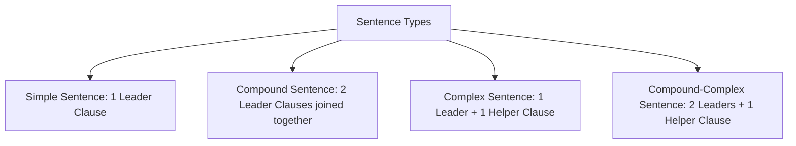

# MAKAUT HM-HU201: English — Unit 2: Basic Writing Skills

## 1. Phrases and Clauses: The Lego Blocks of Sentences

To write great sentences, we first need to look at the two types of word blocks we use: phrases and clauses.

### A. What is a Phrase?
Think of a **phrase** as a small team of words that work together, but they do *not* tell a full story. They are missing either the "who" (the subject) or the "action" (the verb). If you say a phrase by itself, people will be confused!

Here are the common types of phrases:
* **Noun Phrase (The Naming Team):** This is a noun plus the words describing it.  
  * *Example:* **The big, fluffy dog** ran around. (The bold words acts like one big subject).
* **Verb Phrase (The Action Team):** This is the main action word along with its helper words.  
  * *Example:* She **has been reading** all day.
* **Prepositional Phrase (The Map Team):** This shows *where* or *when* something is. It starts with words like *on, in, under, at, after*.  
  * *Example:* The cat slept **under the wooden table**.
* **Adjective Phrase (The Describing Team):** A group of words that describes a person or thing.  
  * *Example:* I drank water **cold as ice**. (Describes the water).
* **Adverb Phrase (The How/When Team):** A group of words that explains *how* or *how fast* something happens.  
  * *Example:* The runner finished the race **in a super fast way**. (Explains how he ran).

### B. What is a Clause?
A **clause** is a bigger group of words that *does* have both a subject (the star of the show) and a verb (the action). There are two kinds of clauses:

1. **Independent Clause (The Leader):** This clause is strong! It makes perfect sense on its own and can stand as a complete sentence.  
   * *Example:* **The sun shined.**
2. **Dependent Clause (The Helper):** This clause has a subject and a verb, but it starts with a connecting word (like *because, if, when, since, although*). It cannot stand alone because it leaves you waiting for the rest of the story!  
   * *Example:* **When the sun shined...** (What happened? We need to know!).

#### Three Types of Helper (Dependent) Clauses:
* **Noun Clause:** Acts like a single noun.  
   * *Example:* I know [what you want for lunch]. (The bracketed words act as the object of "know").
* **Adjective Clause:** Acts like an adjective to describe a noun. It starts with *who, which, that, whose*.  
   * *Example:* The toy [that you gave me] is awesome. (Describes the toy).
* **Adverb Clause:** Explains *why*, *when*, or *how* something happened.  
   * *Example:* We went inside [because it started to rain]. (Explains why we went inside).

## 2. Four Types of Sentences

We can join our Lego blocks of words in different ways to make four types of sentences.

### A. Simple Sentence
This is a single Leader (Independent) clause. It has one subject and one action. It is short and direct.
* *Example:* **The dog barked at the mailman.**

### B. Compound Sentence
This joins **two complete Leader sentences** together. You can glue them together in two ways:
1. Using a comma and a connecting word (**FANBOYS**).
2. Using a semicolon (;).

Let's meet the **FANBOYS** connectors:
* **F**or (means because): *We ate dinner, for we were hungry.*
* **A**nd (adds things): *I play soccer, and my brother plays tennis.*
* **N**or (adds a negative choice): *He does not like apples, nor does he like oranges.*
* **B**ut (shows a difference): *I want to play, but it is too cold.*
* **O**r (gives a choice): *We can watch a movie, or we can play a game.*
* **Y**et (shows a surprise): *It was late, yet they kept working.*
* **S**o (shows what happened next): *It started to rain, so we went inside.*

* *Example with Semicolon:* **I made my bed; my sister cleaned her room.**

### C. Complex Sentence
This joins **one Leader clause** and **at least one Helper clause**. We connect them using words like *because, since, if, when, although, after, before*.
* *Example (Helper at the end):* **We missed the school bus** [because we slept late]. (No comma needed!).
* *Example (Helper at the start):* [Because we slept late], **we missed the school bus**.  
  *(Rule: If you put the Helper clause first, you must put a comma after it!).*

### D. Compound-Complex Sentence
This is a long sentence with **two or more Leader clauses** and **at least one Helper clause** all joined together.
* *Example:* [Although we were tired], **we finished our project**, and **we cleaned the classroom**.  
  *(Helper: "Although we were tired"; Leaders: "we finished our project" and "we cleaned the classroom").*

## 3. Transforming Sentences

### A. Active vs. Passive Voice (Who is doing the action?)
* **Active Voice:** The subject (the doer) is active and performs the action. It is strong and direct.
  * *Example:* **The cat [Subject] chased the mouse [Object].**
* **Passive Voice:** The subject is lazy and receives the action. The object moves to the front. We use this when we care more about the object, or don't know who did the action.
  * *Example:* **The mouse [Object] was chased by the cat [Subject].**

Sometimes we don't even say who did it if it's not important:
* *Passive:* *The broken window was fixed.* (We don't need to say "by the repairman").

#### Active to Passive Helper Chart:

| Tense | Active Voice | Passive Voice |
| :--- | :--- | :--- |
| **Present** | *She paints the wall.* | *The wall is painted by her.* |
| **Present Action Happening Now** | *She is painting the wall.* | *The wall is being painted by her.* |
| **Past** | *She painted the wall.* | *The wall was painted by her.* |
| **Past Action Happening Then** | *She was painting the wall.* | *The wall was being painted by her.* |
| **Completed Action (Perfect)** | *She has painted the wall.* | *The wall has been painted by her.* |
| **Future** | *She will paint the wall.* | *The wall will be painted by her.* |

### B. Direct vs. Indirect Speech (How we share what others said)
* **Direct Speech:** Showing the exact words someone spoke, using quotation marks "".
  * *Example:* *He said, "I am going to school today."*
* **Indirect Speech:** Retelling what someone said. Since they said it in the past, we have to "push the words back in time" (change the tense) and change the pronouns (*I* becomes *he/she*).
  * *Example:* *He said that he was going to school that day.*

#### How to Change Direct to Indirect:

##### 1. Push the Action back in Time (Tense Shift):
* Present -> Past (*eat* -> *ate*)
* Present Continuous -> Past Continuous (*is eating* -> *was eating*)
* Past -> Past Perfect (*ate* -> *had eaten*)
* Will -> Would (*will help* -> *would help*)
* Can -> Could (*can run* -> *could run*)
* May -> Might (*may rain* -> *might rain*)
* Must -> Had to (*must go* -> *had to go*)

##### 2. Change Time and Location Words:
* *Today* becomes *that day*
* *Yesterday* becomes *the day before*
* *Tomorrow* becomes *the next day*
* *Here* becomes *there*
* *Now* becomes *then*

##### 3. Reporting Questions:
* **Yes/No Questions:** Use the word *asked* and add *if* or *whether*.
  * *Direct:* *"Are you cold?" he asked.* -> *Indirect:* *He asked if I was cold.*
* **Wh- Questions:** Keep the question word (*where, why, what*), but switch the order so the subject comes before the action verb.
  * *Direct:* *"Where is my pencil?" she asked.* -> *Indirect:* *She asked where her pencil was.* (Do not say: *where was her pencil*).

##### 4. Reporting Commands and Requests:
Change "said to" to *told, ordered,* or *asked*, and use *to* + *action*.
* *Direct:* *"Please stand up," the teacher said.* -> *Indirect:* *The teacher asked us to stand up.*
* *Direct:* *"Don't touch the stove," my dad said.* -> *Indirect:* *My dad told me not to touch the stove.*

## 4. Punctuation: The Traffic Signs of Writing

Punctuation marks are like traffic signs on a road. They tell you when to pause, stop, or turn.

### A. The Comma (,) (The Speed Bump)
The comma tells you to pause for a split second. Use it:
* In lists: *I love reading, drawing, and swimming.* (The comma before "and" is called the Oxford Comma—it keeps your list clear!).
* After a Helper clause starts a sentence: *When the bell rang, we packed our bags.*

### B. Semicolons (;) vs. Colons (:)
* **Semicolon (;):** Connects two complete sentences that are best friends (closely related), without using a connector word.
  * *Example:* *My dog loves bones; my cat prefers fish.*
* **Colon (:):** Tells the reader to look for a list or an explanation. What comes before the colon *must* be a complete sentence.
  * *Example:* *You need three things for art class: paper, paint, and brushes.*

### C. The Apostrophe (') (The Shrinker & Owner)
Apostrophes have only two jobs:
1. **Showing Ownership:**
   * One person owns it: *the girl's toy* (one girl owns the toy).
   * Multiple people own it: *the girls' toys* (many girls own the toys).
2. **Shrinking Words (Contractions):**
   * *do not* becomes *don't*.
   * *it is* becomes *it's*.

> [!CAUTION]
> **It's vs. Its:**
> * **It's** always means "it is" (*It's a sunny day*).
> * **Its** means "belonging to it" (*The bird built its nest*). Never put an apostrophe in the possessive *its*!

## 5. Flow and Simple Writing

* **Cohesion:** Using connecting words to glue your sentences together so they glide smoothly.
* **Precise Writing:** Getting rid of "word clutter" to make your writing clear and easy to read. Don't use ten words when five will do!

### Clearing Out Word Clutter:
* *Cluttered:* *Due to the fact that I was feeling sick, I made the decision to stay home.*
* *Clear:* *Because I was feeling sick, I stayed home.*
* *Cluttered:* *At this point in time, the teacher is in the process of grading.*
* *Clear:* *Currently, the teacher is grading.*

## 6. Easy Memory Tricks

* **FANBOYS:** For, And, Nor, But, Or, Yet, So (used to connect two complete sentences).
* **The "Who did it?" Modifier Test:** After a starting action phrase (like "Eating breakfast,"), ask: "Who was doing this?" Make sure that person is the very next word after the comma!

## 7. Practice Questions

### Part A: Phrase or Clause?
Is the bolded part a **Phrase** or a **Clause**?

1. **Under the bed**, the monster hid.
2. I was late **since my bicycle broke**.
3. The boy **who is wearing the blue cap** is my brother.

#### Answers:
1. **Phrase** (no subject/verb combination; just tells us where).
2. **Clause** (contains subject "my bicycle" and verb "broke").
3. **Clause** (an adjective clause describing the boy).

### Part B: Active to Passive Voice
Change these sentences to Passive Voice:

1. The boy kicked the ball.
2. My mom is baking cookies.
3. The girl won the game.

#### Answers:
1. **The ball was kicked by the boy.**
2. **Cookies are being baked by my mom.**
3. **The game was won by the girl.**

### Part C: Direct to Indirect Speech
Convert these sentences into Indirect Speech:

1. "I can help you build this Lego set," dad said.
2. "Where are my shoes?" Tim asked.
3. "Do not jump on the bed," mom said.

#### Answers:
1. **Dad said that he could help me build that Lego set.**
2. **Tim asked where his shoes were.**
3. **Mom told me not to jump on the bed.**

### Part D: Clear the Clutter
Make this sentence short and easy to understand:
* *Cluttered:* *It is necessary that you read your books for the purpose of getting ready for the quiz.*

#### Answer:
* **You must read your books to get ready for the quiz.** (Or: *Read your books to prepare for the quiz.*)
