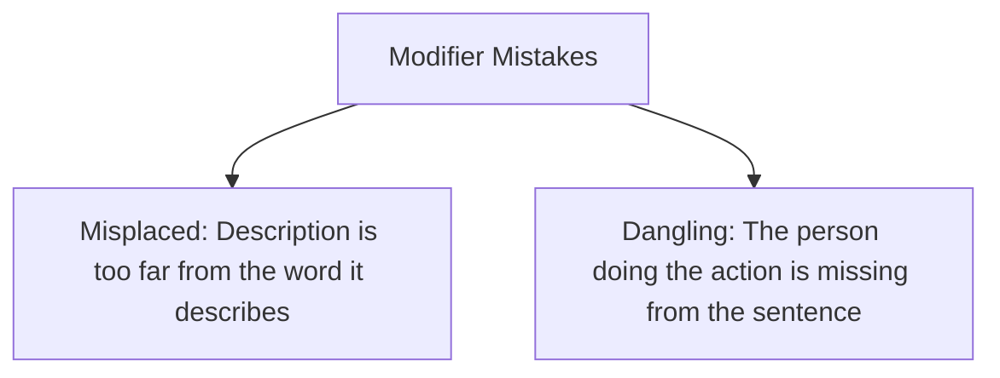

# MAKAUT HM-HU201: English — Unit 3: Identifying Common Errors in Writing

## 1. Subject-Verb Agreement (Making them match)

The golden rule is: **A singular subject (one person or thing) needs a singular verb. A plural subject (more than one) needs a plural verb.**
* *Singular:* **The cat sleeps** on the rug.
* *Plural:* **The cats sleep** on the rug.

Here are the tricky exceptions that trip people up:

### A. Intervening Phrases (Extra details in the middle)
Sometimes, words like *along with*, *as well as*, and *in addition to* get sandwiched between the subject and the verb. Ignore them! Look only at the main subject.
* **Incorrect:** *The teacher, along with her students, are going to the museum.*
* **Correct:** *The teacher [singular], along with her students, **is** going to the museum.*

### B. The Proximity Rule (Or / Nor)
When you connect subjects using *or* or *nor*, the verb agrees with whichever subject is **closest** to it.
* **Incorrect:** *Neither the apples nor the banana were ripe.*
* **Correct:** *Neither the apples nor the banana [singular] **was** ripe.*
* **Correct:** *Neither the banana nor the apples [plural] **were** ripe.*

### C. Indefinite Pronouns (Everyone, Each, Someone)
Words like *each*, *every*, *everyone*, *someone*, *nobody*, *either*, and *neither* sound like they are about a lot of people, but grammatically they are **always singular**.
* **Incorrect:** *Each of the players have a uniform.*
* **Correct:** *Each of the players **has** a uniform.*
* **Incorrect:** *Everyone are excited for the field trip.*
* **Correct:** *Everyone **is** excited for the field trip.*

### D. Collective Nouns (Group Names)
Words for groups like *team*, *family*, and *committee* are usually treated as a single unit, so they take a **singular** verb.
* **Correct:** *My family **is** going on vacation.*
* **Correct:** *The team **wins** the championship.*
---
## 2. Noun-Pronoun Matching

A pronoun (like *he, she, it, they*) must match the noun it replaces.

### A. Number Agreement
If the noun is singular, use a singular pronoun.
* **Incorrect:** *Every student should bring their own notebook.*
* **Correct (Traditional):** *Every student should bring **his or her** own notebook.*
* **Correct (Plural Shift):** *All students should bring **their** own notebooks.*

### B. Pronoun Case: Subjective vs. Objective
* Use **Subjective pronouns** (*I, he, she, we, they*) when the pronoun is the one doing the action.
* Use **Objective pronouns** (*me, him, her, us, them*) when the pronoun is receiving the action, or after words like *between*, *with*, *to*, and *for*.
* **Incorrect:** *This is a secret between you and I.*
* **Correct:** *This is a secret between you and **me**.*

## 3. Misplaced and Dangling Modifiers (Confusing Descriptions)

A **modifier** is a word or phrase that describes something. If you place it in the wrong spot, it can make your sentence sound hilarious and confusing!

### A. Misplaced Modifiers
* **Incorrect:** *I saw a dog in my pajamas.*  
  *(Wait, was the dog wearing your pajamas?)*
* **Correct:** *While wearing my pajamas, I saw a dog.*

### B. Dangling Modifiers
This happens when you start a sentence with a descriptive action, but forget to name the person doing it right after the comma.
* **Incorrect:** *Walking down the street, the trees were beautiful.*  
  *(Wait, were the trees walking down the street?)*
* **Correct:** *Walking down the street, **I** noticed the beautiful trees.*

## 4. Articles and Prepositions

### A. Articles: A vs. An
Use *an* before vowel **sounds**, not just vowel letters.
* **A** university (sounds like it starts with a "Y" sound: *yoo-ni-ver-sity*).
* **An** hour (the "H" is silent, so it sounds like *our*).
* **A** horse (you pronounce the "H").

### B. Confusing Prepositions
Prepositions are little words like *in*, *on*, *at*, *with*, and *to*. Sometimes we use the wrong ones by accident.

* **Agree with** a person: *I agree **with** my teacher.*
* **Agree to** an idea or plan: *I agree **to** the class rules.*
* **Comply with** rules: *We must comply **with** the school policy.* (Do not say: *comply to*).
* **Discuss** (no preposition needed!): *We will discuss the book.* (Do not say: *discuss about*).

## 5. Redundancies and Clichés (Wordy and Overused Writing)

### A. Redundancies (Saying the same thing twice)
Avoid using extra words that repeat a meaning you have already said.
* *Do not say:* "Return back" -> *Just say:* **Return** (returning already means going back).
* *Do not say:* "Free gift" -> *Just say:* **Gift** (a gift is always free).
* *Do not say:* "Revert back" -> *Just say:* **Revert** (reverting already means going back).
* *Do not say:* "New innovation" -> *Just say:* **Innovation** (an innovation is always new).

### B. Clichés (Overused phrases)
Clichés are phrases that have been used so many times they have become boring. Try to use simple, fresh words instead.

* *Cliché:* "At the end of the day" -> *Better:* **Ultimately** or **In the end**
* *Cliché:* "Think outside the box" -> *Better:* **Think creatively**
* *Cliché:* "Last but not least" -> *Better:* **Finally**

## 6. Easy Memory Tricks

* **The "Near is Dear" Rule:** For *or* and *nor*, the verb agrees with the subject that is closest to it.
* **The "Who did it?" Modifier Test:** After an action phrase at the start of a sentence (like "Cooking dinner,"), ask yourself: "Who was doing this?" Make sure that person is the very next word after the comma!

## 7. Practice Questions

Spot the error in each sentence and write the correct version:

1. Everyone in the classroom are reading a book.
2. Neither the coach nor the players was ready for the game.
3. Having finished my dinner, the dishes were washed.
4. We waited for a hour at the bus station.
5. We need to discuss about our project timeline.

#### Answers & Explanations:
1. **Incorrect:** *Everyone... are*  
   **Correct:** **Everyone in the classroom is reading a book.**  
   *(Explanation: "Everyone" is singular, so it needs the singular verb "is").*
2. **Incorrect:** *players... was*  
   **Correct:** **Neither the coach nor the players were ready for the game.**  
   *(Explanation: The subject closest to the verb is the plural noun "players," so we use the plural verb "were").*
3. **Incorrect:** *Having finished... the dishes*  
   **Correct:** **Having finished my dinner, I washed the dishes.**  
   *(Explanation: The dishes did not eat the dinner! "I" must follow the comma because I finished the dinner).*
4. **Incorrect:** *a hour*  
   **Correct:** **We waited for an hour at the bus station.**  
   *(Explanation: Even though "hour" starts with the letter "H," the "H" is silent. Since it sounds like it starts with a vowel, we use "an").*
5. **Incorrect:** *discuss about*  
   **Correct:** **We need to discuss our project timeline.**  
   *(Explanation: We do not need the word "about" after "discuss").*
